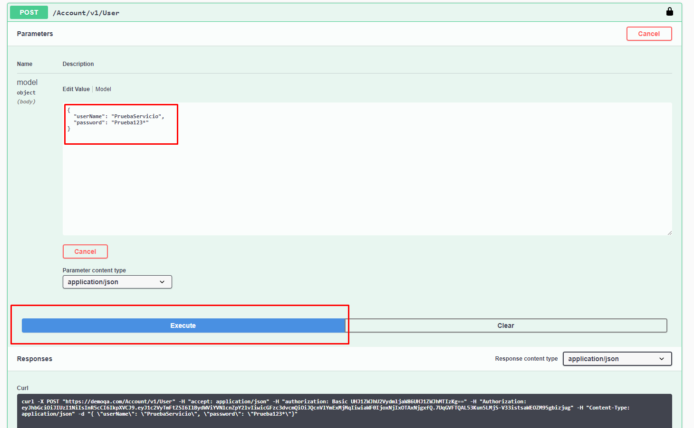

# Introduction
Construccion de pruebas automatizadas con el Patrón Screenplay de Serenity, Cucumber, Junit,
Java y Gradle para probar servicios REST

Para esta automatización se utilizan los siguientes servicios expuestos en:

- ###https://demoqa.com

##Patrón de diseño utilizado

- ### [Patron Serenity Screenplay](http://serenity-bdd.info/docs/articles/screenplay-tutorial.html)

###Pruebas construidas  -  REST 

- AutorizedRunner
- DeleteRunner

##Antes de  descargar el proyecto

- Java JDK 1.8
- Gradle 3.2.0 o superior
- Intellij IDEA community / Eclipse
- GIT

##Configuración Servicio

1. Nos dirigimos al siguiente enlace:

```         
   https://demoqa.com/swagger/#/Account/AccountV1UserPost
```
2. Modificamos  los valores   para el servicio     (  /Account/v1/User )
       
       
            {
            "userName": "PruebaServicio",
            "password": "Prueba123*"
            }

3. Presionamos el boton **Execute** para habilitar el servicio y en cada ejecución que realice la  automatizacion se debe realizar este proceso.



#Compilación

Ya descargado el proyecto, se debe importar  en el IDE de preferencia.

Es importante compilar el proyecto para esto, ejecutar alguno de los siguientes comandos.
Ejecutar por consola

```
   gradle clean build -x test
   gradle compileJava
```

#Ejecución


Para ejecutar todos los test del proyecto y generar el reporte puede usar.

```
   gradle clean test aggregate
```


**NOTA:** El reporte generado de las pruebas se genera en la ruta 

```
   /target/site/serenity/index.html
```


